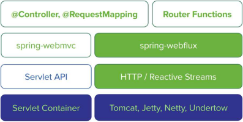
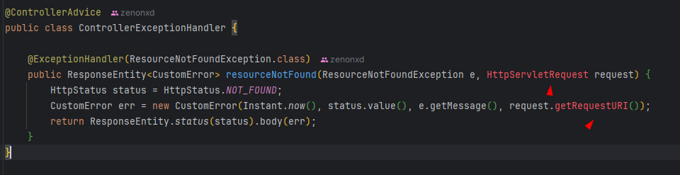

<p align="center">
  
</p>

# Objetivo

Motivação para Spring WebFlux e alguns conceitos chaves como programação reativa, programação síncrona e assíncrona e as
diferenças entre Spring MVC e WebFlux.

Implementar Back end reativo com Spring WebFlux e MongoDB.

# Introdução

A principal motivação para o surgimento de aplicações reativas é a necessidade de escalar aplicações.

Escalar significa que a aplicação precisa ser preparada para suportar um número maior de requisições, ou seja, um maior
processamento.

Em geral, **quanto maior o consumo de uma aplicação**, mais a gente acaba pagando por ela.

**Consumo = número de requisições.**

Um ótimo exemplo é a Black Friday ou semana de natal, onde aumenta-se muito o número de acessos e requisições.

Este infográfico é um ótimo exemplo visual do que acontece na internet em apenas um minuto (2021):


# Programação reativa

Entendemos no tópico anterior que o motivo do surgimento da programação reativa foi, por exemplo, altos índices de 
requisições, demandando um maior processamento.

## O que define a programação reativa?

A utilização de streams (fluxo de dados). Dentro do contexto de programação reativa, TUDO é stream e estamos trabalhando
com operações assíncronas.

Operações assíncronas = requisições que podem ser processadas e executadas de maneira paralela, não precisamos terminar
uma requisição para atender outra.

## Padrão Observer

Veja o exemplo abaixo:

Temos um Publisher (uma entidade) que publicará os dados. 

Esses dados serão trocados por streams (fluxos de dados).

A partir dessas streams, conseguimos manusear esses dados concatenando, por exemplo, com outras streams.

E também teremos o Subscriber (outra entidade). Esse Subscriber irá se inscrever e quando essa stream tiver pronta, 
o Subscriber irá CONSUMIR essa stream.


A ideia de trabalhar com Publisher e Subscriber é permitir que o usuário se inscreva e assim que a informação estiver
disponível, o mesmo é notificado, podendo então consumir este dado.

Um ótimo exemplo disso, é o Youtube com suas livestreams. Imagine que o Professor Nélio vá fazer uma live em uma 
quinta-feira. Você pode ir até o YouTube e clicar no botão "Receber notificações".

O Youtube do professor Nélio neste caso, é o Publisher (publicará este evento, onde o mesmo ficará disponível) e nos
notificará. Onde assim, podemos notificar (acessar) essa live.

## Características programação reativa

### São assíncronas

Trabalham de maneira simultânea e não bloqueante. Para entendermos isso, iremos comparar a maneira assíncrona com síncrona.

#### Modelo síncrono (bloqueante)


Temos 03 requisições para serem processadas (amarela, roxa e azul).

A roxa só será processada após o término da requisição 1 (amarela) que chegou primeiro. Mesma coisa com o azul.

#### Modelo assíncrono (não bloqueante)


Já no modelo assíncrono, a requisição roxa está sendo processada (e até mesmo finalizada) mesmo com a amarela em
processamento.

Seguiremos o modelo assíncrona com o Webflux.

# Spring MVC x Spring Webflux

Em resumo: O Spring Webflux é a versão reativa, assíncrona e não bloqueante do Spring MVC. 

Note as diferenças:

## Spring MVC

O **spring-webmvc** é baseado na API do servlet do Java. Como característica, essa API **é síncrona e bloqueante**.

Uma outra coisa é container do servidor de aplicação. A do Spring MVC roda no Servlet Container (Tomcat), que por padrão
é síncrono e bloqueante.



Essa imagem é um modelo de como o Spring MVC trata as requisições. ⬇️


Quando o Request#1 bater na Representation Layer (Controller), será criado uma Servlet thread#1. Essa thread será enviada
para a DB Layer (Repository) e ficará bloqueada (veja o blocked). Somente quando houver a resposta de volta, ela será 
desbloqueada (por isso ela é sincrona e bloqueante).

Somente depois da thread#1 ser respondida que a Request#2 será iniciada.

## Spring Webflux

Já o **spring-webflux** é baseado nas reactive streams, ou seja, assíncronas e não bloqueantes.

Seu servidor padrão é o Netty, ele é totalmente reativo! Ele funciona com o princípio de "event loop", onde veremos
depois.


❗As versões mais atualizadas do Tomcat, permite que o mesmo seja trabalhado com webflux, mas por padrão utilizaremos o
Netty.

Essa imagem é um modelo de como o Spring Webflux trata as requisições. ⬇️


Temos o mesmo Request#1 do exemplo do MVC. 

Quando esse request bate no Controller (representation layer), será transformado em um evento (ou uma stream). Esse
evento será jogado num looping (um laço) onde será tratado pelo Webflux no event loop (uma fila).

Event Loop: pode ser que cheguem várias requisições de maneira simultânea. O Webflux tentará instanciar o mínimo possível 
de threads. Essas requisições ficarão nessa fila até que sejam processadas.

Para que o event handler funcione de maneira REATIVA, o nosso DB também precisa ser reativo. Como um banco não relacional
(MongoDB). Precisamos prover dados reativos para esse banco, para que todo o processo ocorra de maneira reativa também.

### Spring Data Webflux MongoDB

Antes se fosse um banco de dados Mongo, implementaríamos a sua interface com MongoRepository. Agora será com Reactive:


O que muda, é o retorno. Repare no findById.

Retornaremos um tipo genérico e o seu retorno será Mono. Esse retorno é para quando será retornado no máximo até 1 objeto.

O findAll por sua vez, retornará um Flux (0 ou N elementos).

O save também retorna mono (um único elemento).

# Apresentação projeto

Teremos a nossa fonte de dados (data source), trabalhando com o MongoDB (reativo).

Trocaremos o Spring MVC da aplicação para Webflux.


Temos a camada do Repository que fará a comunicação com o banco de dados. E o repository retornará um tipo de dado flux
para o Controller (teremos o service no meio de campo para regras de negócio).

## Configurando MongoDB

Entrar em [Cloud MongoDB](https://cloud.mongodb.com) e se registrar.

Ir em deploy cluster.

Usaremos Google Cloud! O nome será google-cloud-webflux-mongo.

Criar um user e colocar em Security o nosso IP (exclua o atual).

Iremos para o MongoDB Compass (para visualizar o banco de dados).

No site do Mongo, ir em connect e selecionar o Compass.


No MongoDB compass, conectar usando a connection string fornecida no site e passe a senha do user.

Agora, conectaremos na IDE.

Vá em application.properties, e troque pela url fornecida aqui:


Além disso, crie também uma database:


E depois, vá no MongoDB Compass > conexão > create database. Crie uma collection de user também (uma das entidades do
projeto).


Iniciando o projeto, a ideia é que a Collection de user criada esteja mapeada com os dados do TestConfig.


## Incluindo dependência e alterando repositories

### Dependência

Para modificar de MVC para Webflux, precisamos adicionar algumas dependências:

O spring data mongodb, virará reactive.

E o springweb, virará webflux.

Ao trocar essas dependências, terá alguns erros de código no projeto que iremos aos poucos adequar.

```xml
<dependency>
    <groupId>org.springframework.boot</groupId>
    <artifactId>spring-boot-starter-data-mongodb-reactive</artifactId>
</dependency>
<dependency>
    <groupId>org.springframework.boot</groupId>
    <artifactId>spring-boot-starter-webflux</artifactId>
</dependency>
```

### Repositories

Atualmente nossos Repositories extendem do MongoRepository, será ReactiveMongoRepository, onde agora trabalharemos
com Mono e Flux <T>.

### ControllerException



Lembra do servlet do MVC? Não trabalharemos mais com ele e sim com ServerHttpRequest.


### Seeding dados com Reactive MongoDB

Quando trabalhamos com programação reativa no Spring Webflux, teremos dois objetos que representarão streams: do tipo 
Mono (0 ou 1 elemento) e Flux (0 ou N elementos).

❗Lembrar sempre do subscribe após realocar em uma variável.

deleteAll:
-
Seu retorno é do tipo mono e void! Mas esse void é encapsulado por uma stream (mono), ou seja, 0 ou 1 objeto somente.

A ideia é obtermos esse retorno de Mono, e dar um subscribe (inscrever neste evento).


### Após alteração


saveAll
-


Seu retorno é do tipo Flux e um Iterable.

### Após alteração


insertPosts
-

Mesma coisa, é um saveAll. Retornará um flux do tipo iterable (Post).

saveUser
-

Save retornará Mono do tipo User.


### Controller

### Service